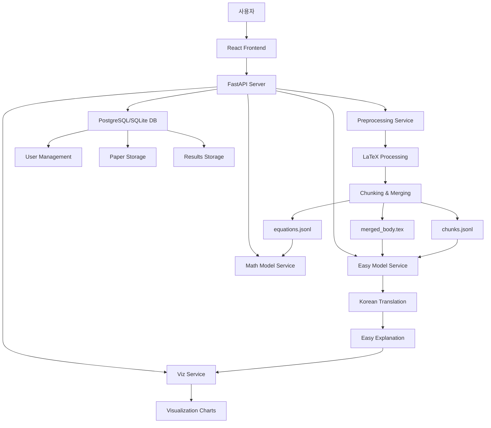

# 🎓 POLO - AI 논문 이해 도우미

> **Paper Understanding with Language Optimization**  
> 복잡한 학술 논문을 누구나 이해할 수 있는 쉬운 설명으로 변환하는 AI 기반 플랫폼

---

## 📋 프로젝트 개요

POLO는 어려운 학술 논문을 일반인도 쉽게 이해할 수 있도록 AI 기술을 활용하여 재해석하고 시각화하는 종합 플랫폼입니다. LaTeX 기반 논문을 자동으로 전처리하고, AI 모델을 통해 쉬운 한국어로 변환한 후, 이해를 돕는 시각적 자료를 자동 생성합니다.

### 🎯 주요 목표
- **접근성 향상**: 전문 용어와 복잡한 수식을 일상 언어로 변환
- **시각화 지원**: 논문 내용을 이해하기 쉬운 차트와 다이어그램으로 표현  
- **자동화**: PDF 업로드부터 최종 결과물까지 완전 자동화된 파이프라인
- **다국어 지원**: 한국어 번역 및 다국어 시각화 제공

---

## 🏗️ 시스템 아키텍처



### 🔧 핵심 서비스 구성

| 서비스 | 포트 | 기술 스택 | 주요 기능 |
|--------|------|-----------|-----------|
| **Frontend** | 3000 | React + TypeScript + Vite | 사용자 인터페이스, 파일 업로드, 결과 표시 |
| **Backend Server** | 8000 | FastAPI + SQLAlchemy | API 게이트웨이, 사용자 관리, 데이터베이스 |
| **Preprocessing** | 5001 | Python + LaTeX | 논문 전처리, 섹션 분할, 수식 추출 |
| **Easy Model** | 5003 | Llama 3.2 + QLoRA | 쉬운 설명 생성, 한국어 번역 |
| **Math Model** | 5004 | Qwen2.5-Math | 수식 해석, 수학적 내용 분석 |
| **Viz Service** | 5005 | Matplotlib + Python | 시각화 차트 생성, 다이어그램 렌더링 |

---

## 🚀 주요 기능

### 1. 자동 논문 처리
- **PDF 업로드**: 드래그 앤 드롭으로 간편한 파일 업로드
- **arXiv 연동**: arXiv ID로 자동 논문 다운로드 및 처리
- **LaTeX 변환**: PDF를 LaTeX 소스로 자동 변환
- **섹션 분할**: Abstract, Introduction, Methods, Results, Discussion, Conclusion 자동 인식

### 2. AI 기반 내용 변환
- **Easy Model**: Llama 3.2-3B 기반 LoRA 파인튜닝 모델
  - 전문 용어를 일상 언어로 변환
  - 복잡한 문장을 단계별로 분해
  - 구체적인 비유와 예시 제공
  - 중학생도 이해할 수 있는 수준으로 조정

- **Math Model**: Qwen2.5-Math-1.5B 기반
  - 수식 자동 추출 및 분류
  - 수학적 개념 해석
  - Example → Explanation → Conclusion 형식 설명

### 3. 다국어 지원
- **Google Translate API**: 영어 → 한국어 자동 번역
- **다국어 시각화**: 한국어/영어 병기 차트 생성
- **로컬라이제이션**: 사용자 언어 설정에 따른 UI 조정

### 4. 지능형 시각화
- **자동 차트 생성**: 텍스트 분석을 통한 적절한 시각화 유형 선택
- **다양한 차트 유형**:
  - Bar Chart (성능 비교)
  - Donut Chart (비율 표시)
  - Scatter Plot (상관관계)
  - Flow Diagram (프로세스)
  - Token Sequence (텍스트 분석)
- **한글 폰트 지원**: matplotlib 한글 렌더링 최적화

### 5. 사용자 관리
- **회원가입/로그인**: 이메일 기반 사용자 인증
- **프로필 관리**: 닉네임, 직업 등 개인정보 설정
- **결과 저장**: 처리된 논문 결과 영구 저장
- **히스토리 관리**: 사용자별 처리 이력 추적

---

## 🛠️ 기술 스택

### Frontend
- **React 18** + **TypeScript**: 타입 안전한 컴포넌트 기반 UI
- **Vite**: 빠른 개발 서버 및 빌드 도구
- **React Router**: SPA 라우팅 관리
- **Context API**: 전역 상태 관리
- **CSS3**: 반응형 디자인 및 애니메이션

### Backend
- **FastAPI**: 고성능 비동기 웹 프레임워크
- **SQLAlchemy**: ORM 및 데이터베이스 추상화
- **PostgreSQL**: 메인 데이터베이스 (SQLite 폴백)
- **Pydantic**: 데이터 검증 및 직렬화
- **httpx**: 비동기 HTTP 클라이언트

### AI/ML
- **Transformers**: Hugging Face 모델 라이브러리
- **PyTorch**: 딥러닝 프레임워크
- **LoRA**: 효율적인 모델 파인튜닝
- **CUDA**: GPU 가속 처리
- **Google Translate API**: 번역 서비스

### 데이터 처리
- **LaTeX**: 논문 포맷팅 및 수식 처리
- **Matplotlib**: 시각화 및 차트 생성
- **NumPy**: 수치 계산
- **Pandas**: 데이터 분석 및 조작
- **정규표현식**: 텍스트 패턴 매칭

### DevOps
- **Docker**: 컨테이너화 및 모델 파인튜닝 환경
- **Batch Scripts**: Windows 자동화 스크립트
- **Environment Variables**: 설정 관리
- **Logging**: 구조화된 로그 시스템

---

## 📁 프로젝트 구조

```
polo-system/
├── 📁 polo-front/                 # React 프론트엔드
│   ├── src/
│   │   ├── pages/                # 페이지 컴포넌트
│   │   ├── contexts/             # React Context
│   │   ├── components/           # 재사용 컴포넌트
│   │   └── styles.css            # 전역 스타일
│   └── package.json
│
├── 📁 server/                     # FastAPI 백엔드
│   ├── routes/                   # API 라우터
│   ├── services/                 # 비즈니스 로직
│   ├── data/                     # 데이터 저장소
│   └── requirements.api.txt
│
├── 📁 preprocessing/              # 전처리 서비스
│   └── texprep/
│       ├── src/texprep/          # 핵심 전처리 로직
│       ├── configs/              # 설정 파일
│       └── requirements.pre.txt
│
├── 📁 models/                     # AI 모델 서비스
│   ├── easy/                     # 쉬운 설명 생성 모델
│   │   ├── app.py               # FastAPI 서버
│   │   ├── hf_cache/            # 모델 캐시
│   │   └── requirements.easy.txt
│   │
│   ├── math/                     # 수학 해석 모델
│   │   ├── app.py               # FastAPI 서버
│   │   ├── hf_cache/            # 모델 캐시
│   │   └── requirements.math.txt
│   │
│   └── fine-tuning/              # 모델 파인튜닝
│       ├── training/             # 훈련 스크립트
│       └── outputs/              # 훈련 결과
│
├── 📁 viz/                        # 시각화 서비스
│   ├── grammars/                 # 시각화 문법
│   ├── templates/                # 차트 템플릿
│       ├── grammars/             # 시각화 문법
│       └── generic_rules.py      # 시각화 문법 - 수치 없는 예시 시각화
│   ├── charts/                   # 생성된 차트
│   ├── app.py                    # FastAPI 서버
│   ├── switch.py                 # 시각화 라벨 한/영 병기 스위치 유틸 
│   ├── registry.py               # 도형 문법을 등록/조회하는 레지스트리
│   ├── text_to_spec.py           # 텍스트 → spec 자동 빌더(JSON)
│   ├── glossary_hybrid.json      # 한/영 용어 사전
│   └── requirements.viz.txt
│
├── 📁 tests/                      # 테스트 코드
├── 📄 run_system.bat             # 시스템 실행 스크립트
├── 📄 .env                       # 환경 변수
└── 📄 README.md                  # 프로젝트 문서
```

---

## 🚀 빠른 시작

### 1. 환경 설정
```bash
# 저장소 클론
git clone <repository-url>
cd polo-system

# 환경 변수 설정
cp .env.example .env
# .env 파일에서 필요한 설정값 입력
```

### 2. 의존성 설치
```bash
# Windows에서 자동 설치 및 실행
run_system.bat

# 또는 수동 설치
# 프론트엔드
cd polo-front
npm install

# 백엔드 서비스들
pip install -r server/requirements.api.txt
pip install -r preprocessing/texprep/requirements.pre.txt
pip install -r models/easy/requirements.easy.txt
pip install -r models/math/requirements.math.txt
pip install -r viz/requirements.viz.txt
```

### 3. 서비스 실행
```bash
# 모든 서비스 자동 실행 (Windows)
run_system.bat

# 또는 개별 실행
# 1. 전처리 서비스 (포트 5001)
cd preprocessing/texprep && python app.py

# 2. 시각화 서비스 (포트 5005)
cd viz && python app.py

# 3. Easy 모델 (포트 5003)
cd models/easy && python app.py

# 4. Math 모델 (포트 5004)
cd models/math && python app.py

# 5. 백엔드 서버 (포트 8000)
cd server && python -m uvicorn app:app --host 0.0.0.0 --port 8000

# 6. 프론트엔드 (포트 3000)
cd polo-front && npm run dev
```

### 4. 접속
- **프론트엔드**: http://localhost:3000
- **API 문서**: http://localhost:8000/docs
- **서비스 상태**: http://localhost:8000/health

---

## 📊 사용 예시

### 1. 논문 업로드
1. 웹 브라우저에서 http://localhost:3000 접속
2. 회원가입/로그인 후 "논문 변환하기" 클릭
3. PDF 파일을 드래그 앤 드롭으로 업로드
4. 또는 arXiv ID 입력하여 자동 다운로드

### 2. 자동 처리 과정
1. **전처리**: PDF → LaTeX 변환 → 섹션 분할
2. **Easy 모델**: 각 섹션을 쉬운 한국어로 변환
3. **Math 모델**: 수식 추출 및 해석
4. **시각화**: 텍스트 분석을 통한 차트 자동 생성
5. **결과 저장**: 데이터베이스에 처리 결과 저장

### 3. 결과 확인
- **섹션별 변환 결과**: 원문과 쉬운 설명 비교
- **시각화 차트**: 자동 생성된 이해 도구
- **HTML 다운로드**: 완성된 결과물을 HTML로 내보내기

---

## 🔧 설정 및 커스터마이징

### 환경 변수 설정
```bash
# .env 파일 예시
# 데이터베이스
POSTGRES_HOST=localhost
POSTGRES_PORT=5432
POSTGRES_DB=polo
POSTGRES_USER=user
POSTGRES_PASSWORD=password

# AI 모델 설정
EASY_BASE_MODEL=meta-llama/Llama-3.2-3B-Instruct
EASY_ADAPTER_DIR=./models/fine-tuning/outputs/llama32-3b-qlora/checkpoint-4000
EASY_MAX_NEW_TOKENS=1200
EASY_TEMPERATURE=0.7
EASY_TOP_P=0.9

# 서비스 URL
EASY_MODEL_URL=http://localhost:5003
MATH_MODEL_URL=http://localhost:5004
VIZ_MODEL_URL=http://localhost:5005
PREPROCESS_URL=http://localhost:5001

# Google Translate API
GOOGLE_APPLICATION_CREDENTIALS=./path/to/service-account.json
```

### 모델 파인튜닝
```bash
# Docker를 사용한 Easy 모델 파인튜닝
cd models/fine-tuning
docker-compose up --build

# 또는 개별 실행
docker build -t polo-finetuning .
docker run --gpus all -v $(pwd)/outputs:/app/outputs polo-finetuning

# 훈련 데이터 준비
python training/download_and_convert.py
```

---

## 테스트

### 통합 테스트
```bash
# 전체 파이프라인 테스트
python test_arxiv_pipeline.py
```

---

## 📈 성능 최적화

### GPU 메모리 관리
- **Easy Model**: GPU 사용 (CUDA)
- **Math Model**: GPU 사용 (CUDA)
- **Viz Service**: CPU 사용 (메모리 절약)
- **Preprocessing**: CPU 사용

### 모델 최적화
- **LoRA 파인튜닝**: 메모리 효율적인 어댑터 학습
- **Quantization**: 모델 크기 및 추론 속도 최적화
- **Batch Processing**: 여러 청크 동시 처리
- **Caching**: 모델 및 결과 캐싱

---


*이 프로젝트는 학술 논문의 접근성을 높이고, 지식의 자율화를 목표로 합니다.*
